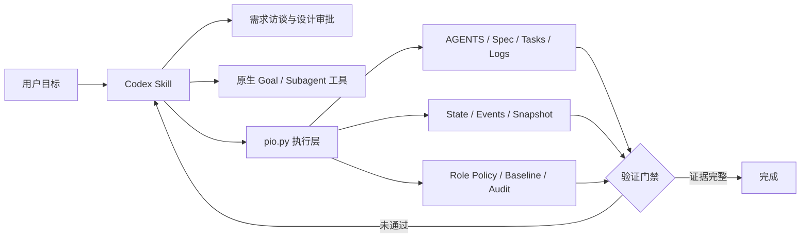

# Project Init Orchestrator

[](https://github.com/jsdnaasd/project-init-orchestrator/actions/workflows/ci.yml)
[](https://github.com/jsdnaasd/project-init-orchestrator/releases)
[](LICENSE)

> 让 Codex 在写代码之前先建立目标、规格、边界和证据，并把这些规则变成可执行检查。

`Project Init Orchestrator` 是一个 Codex-only 项目初始化与多 Agent 治理 Skill。它把需求澄清、Spec-first、Goal/Loop、角色边界、项目记忆和完成审计组织成一套可持续执行的工作流。

它不是另一个大模型，也不会假装创造 Codex 原本没有的运行时能力。Codex 负责访谈、设计判断和原生 Agent 调度；自带的标准库 Python CLI 负责幂等生成、状态迁移、事件持久化、路径审计和验收门禁。

## 为什么需要它

Agent 项目常见的问题不是代码生成速度，而是执行过程失去约束：

- 需求没有问清楚就开始实现。
- 项目目标只存在于聊天记录，换会话后发生漂移。
- 子 Agent 职责重叠或修改了未授权文件。
- Spec、任务和工作日志相互脱节。
- “已经完成”缺少测试、构建和产物证据。

这个 Skill 把上述问题拆成可检查的项目状态和文件契约。

## 已实现能力

| 能力 | 可执行证据 |
| --- | --- |
| 仓库检查与幂等初始化 | `pio inspect`、`pio init`，已有文件默认保留 |
| Goal + Loop 状态机 | 受控阶段迁移，验证、审计和完成阶段要求证据 |
| 持久化项目上下文 | `state.json`、追加式 `events.jsonl`、紧凑 `snapshot.md` |
| 子 Agent 边界治理 | 角色 Brief、路径 allow/forbid 策略、文件哈希基线与变更审计 |
| Spec 与完成门禁 | `validate --stage structure|ready|complete` |
| 安全安装 | 覆盖前自动备份，可恢复卸载，支持 dry-run |
| 行为评测 | 10 个确定性场景覆盖初始化、幂等、状态、审计和上下文恢复 |

当前评测结果为 **10/10 场景通过**。这是本地确定性执行层的测试结果，不代表模型准确率或生产环境可靠性。完整证据见 [评测报告](docs/evaluation-report.md)。

## 架构



更详细的责任边界见 [架构说明](docs/architecture.md)。

## 安装

```bash
git clone https://github.com/jsdnaasd/project-init-orchestrator.git
cd project-init-orchestrator
./install.sh --install
```

默认安装位置：

```text
${CODEX_HOME:-$HOME/.codex}/skills/project-init-orchestrator
```

预览安装操作，不写入文件：

```bash
./install.sh --install --dry-run
```

更新时再次运行安装命令。现有 Skill 会先移动到同目录的时间戳备份。可恢复卸载：

```bash
./install.sh --uninstall
```

卸载同样不会直接删除文件，而是保留备份路径。

## 在 Codex 中使用

安装后新建一个 Codex 对话，在目标项目目录中输入：

```text
使用 $project-init-orchestrator 初始化这个项目。先建立目标并检查仓库，然后逐个询问需求，完成设计和 spec 后再创建有边界的子 Agent，并持续执行到验证完成。
```

Skill 会优先使用 Codex 暴露的原生 Goal 和子 Agent 能力；若宿主没有这些能力，会明确记录降级方式，不会把顺序角色模拟描述成真实并行 Agent。

## CLI 快速使用

CLI 位于安装后的 Skill 内，只有 Python 标准库依赖：

```bash
PIO="$HOME/.codex/skills/project-init-orchestrator/scripts/pio.py"

python3 "$PIO" inspect --project .
python3 "$PIO" init --project . \
  --name "My Project" \
  --objective "Build and verify the approved product"
python3 "$PIO" validate --project . --stage structure
```

初始化后会生成：

```text
AGENTS.md
.project-init-orchestrator/
├── config.json
├── events.jsonl
├── snapshot.md
├── state.json
├── baselines/
└── audits/
docs/
├── agents/subagent-briefs/<role>.md
├── completion-audit.md
├── specs/<date>-project-spec.md
├── tasks/project-tasks.md
└── worklogs/
```

## Goal 与 Loop

正常阶段为：

```text
initialized -> clarify -> spec -> plan -> execute -> verify -> audit -> complete
```

进入 `verify`、`audit`、`complete` 必须提交证据。验证失败时允许回到执行阶段继续迭代：

```bash
python3 "$PIO" transition verify --project . \
  --evidence "python3 -m pytest: 42 passed"
```

完整事件保存在 `events.jsonl`；`compact` 只重新生成紧凑快照，不删除历史：

```bash
python3 "$PIO" compact --project . --recent 10
python3 "$PIO" resume --project .
```

## 子 Agent 边界审计

每个非主 Agent 默认没有写权限。主 Agent 必须先明确配置范围：

```bash
python3 "$PIO" add-role implementation --project .
python3 "$PIO" set-policy implementation --project . \
  --allow 'src/**' \
  --allow 'tests/**' \
  --forbid 'src/secrets/**'
python3 "$PIO" baseline implementation --project .
```

子 Agent 返回后执行：

```bash
python3 "$PIO" audit implementation --project .
```

审计会把变化分成 `allowed`、`forbidden` 和 `outside-scope`，并保存 JSON 报告。它能检测越界变化，但不是操作系统沙箱，不能阻止进程在执行过程中写文件。

## 验证与评测

```bash
uv run --with pytest --with coverage \
  coverage run --source=codex/project-init-orchestrator/scripts -m pytest
uv run --with coverage coverage report --fail-under=80
python3 scripts/validate_repository.py
python3 scripts/run_evaluations.py
uvx ruff check codex/project-init-orchestrator/scripts scripts tests
uvx ruff format --check codex/project-init-orchestrator/scripts scripts tests
```

GitHub Actions 会在 Python 3.10、3.12 和 3.14 上运行仓库验证、测试覆盖率、行为评测和安装 smoke test。

## 项目结构

```text
codex/project-init-orchestrator/
├── SKILL.md
├── agents/openai.yaml
├── assets/templates/
├── references/
└── scripts/pio.py
tests/
scripts/
docs/
examples/
install.sh
```

## 能力边界

- Skill 不能保证宿主一定提供原生 Goal 或子 Agent 工具。
- CLI 不运行后台任务，不是独立 Agent Runtime。
- 路径审计检测基线后的文件变化，不是系统级权限沙箱。
- 当前上下文快照是确定性结构压缩，不是向量记忆或模型生成摘要。
- 当前评测证明的是执行层行为，不证明模型推理质量。

## 简历与宣传

- [可验证的中文简历描述](docs/RESUME.zh-CN.md)
- [中文项目介绍与发布文案](docs/PROJECT_PROMOTION.zh.md)
- [完整演示会话](examples/demo-session.md)
- [安全审查与能力边界](docs/security-review.md)

## License

[MIT](LICENSE)
