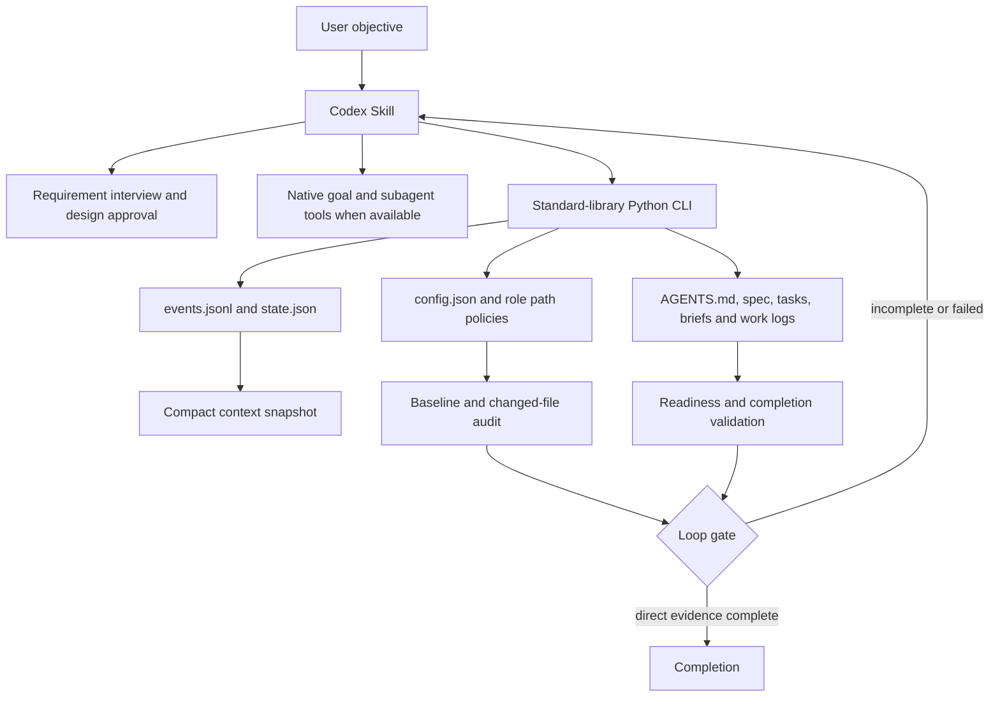

# Architecture

Project Init Orchestrator separates reasoning from deterministic project governance.

## Responsibility Split

| Layer | Responsibility | Explicit Non-Responsibility |
| --- | --- | --- |
| Codex Skill | Triggering, interview protocol, native tool use, orchestration decisions | Does not create new runtime capabilities |
| `pio.py` | File generation, state transitions, event persistence, snapshots, path audits, validation | Does not perform LLM reasoning or run in the background |
| Project documents | Human-readable goal, scope, roles, tasks, decisions, and evidence | Do not enforce policies by themselves |
| Native Codex tools | Goal persistence and real subagent dispatch when exposed by the host | Availability is not guaranteed by the Skill |

## Persistent Project Memory

The event log is the lossless history. `snapshot.md` is a deterministic, bounded view of current state and recent events. Regenerating the snapshot never deletes events, which makes context recovery inspectable instead of relying only on chat history.

## Boundary Model

Role policies use explicit allow and forbid patterns. A baseline captures visible file hashes before delegation. The post-work audit compares hashes and classifies every changed path. This detects scope violations; it does not sandbox a process or prevent operating-system-level writes.
